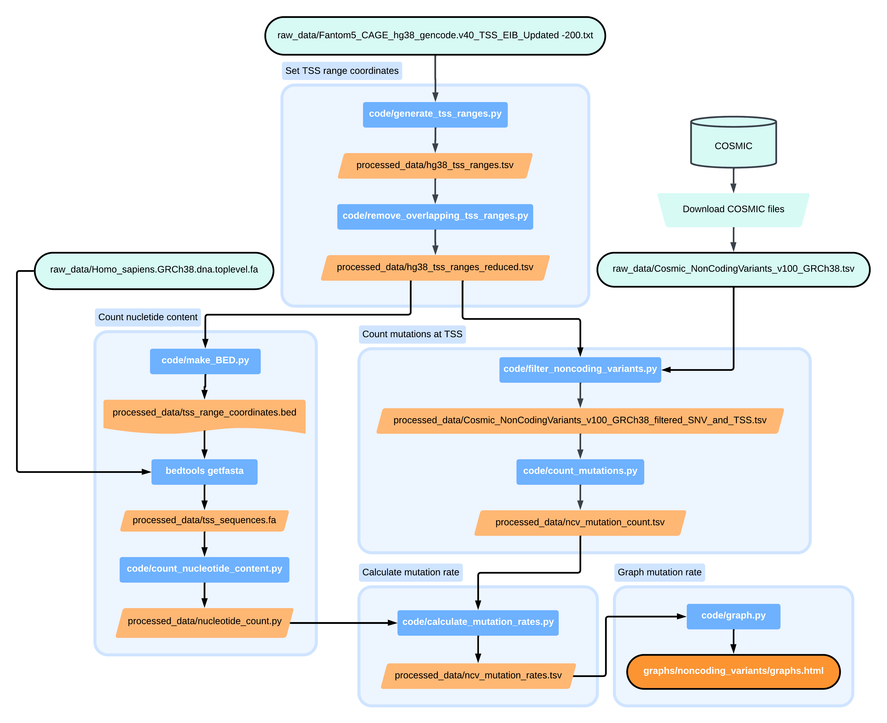

# Analysis of COSMIC data near transcriptional start sites

## How to download this repository
`git clone https://github.com/leung52/cosmic-tss-mutations.git`

## Dependencies
To run the following code, the following packages are required: `pandas`, `plotly`, and `bedtools`.

## Pipeline
The following instructions shows the order in which the coding files should be run with what data files the code needs (input) and what data files will be created (output).

### Set TSS range
`python code/generate_tss_ranges.py`
- input: raw_data/Fantom5_CAGE_hg38_gencode.v40_TSS_EIB_Updated -200.txt
- output: processed_data/hg38_tss_ranges.tsv

`python code/remove_overlapping_tss_ranges.py`
- input: processed_data/hg38_tss_ranges.tsv
- output: processed_data/hg38_tss_ranges_reduced.tsv

### Counting COSMIC mutations
`python code/filter_noncoding_variants.py`
- input: processed_data/hg38_tss_ranges_reduced.tsv, raw_data/Cosmic_NonCodingVariants_v100_GRCh38.tsv
- output: processed_data/Cosmic_NonCodingVariants_v100_GRCh38_filtered_SNV_and_TSS.tsv

`python code/count_mutations.py`
- input: processed_data/hg38_tss_ranges_reduced.tsv, processed_data/Cosmic_NonCodingVariants_v100_GRCh38_filtered_SNV_and_TSS.tsv
- output: processed_data/ncv_mutation_count.tsv

### Count nucleotide content
`python code/make_BED.py`
- input: processed_data/hg38_tss_ranges_reduced.tsv
- output: processed_data/tss_range_coordinates.bed

`bedtools getfasta -fi raw_data/Homo_sapiens.GRCh38.dna.toplevel.fa -bed processed_data/tss_range_coordinates.bed -fo processed_data/tss_sequences.fa -s`
- input: raw_data/Homo_sapiens.GRCh38.dna.toplevel.fa, processed_data/tss_range_coordinates.bed
- output: processed_data/tss_sequences.fa 

`python code/count_nucleotide_content.py`
- input: processed_data/tss_sequences.fa
- output:  processed_data/nucleotide_count.py

### Calculate mutation rates
`python code/calculate_mutation_rates.py`
- input: processed_data/nucleotide_count.tsv, processed_data/ncv_mutation_count.tsv
- output: processed_data/ncv_mutation_rates.tsv

### Graph mutations
code/graph.py
- input: processed_data/ncv_mutation_rates.tsv
- output: 'graphs/noncoding_variants/graph.html'

## Pipeline visualisation

